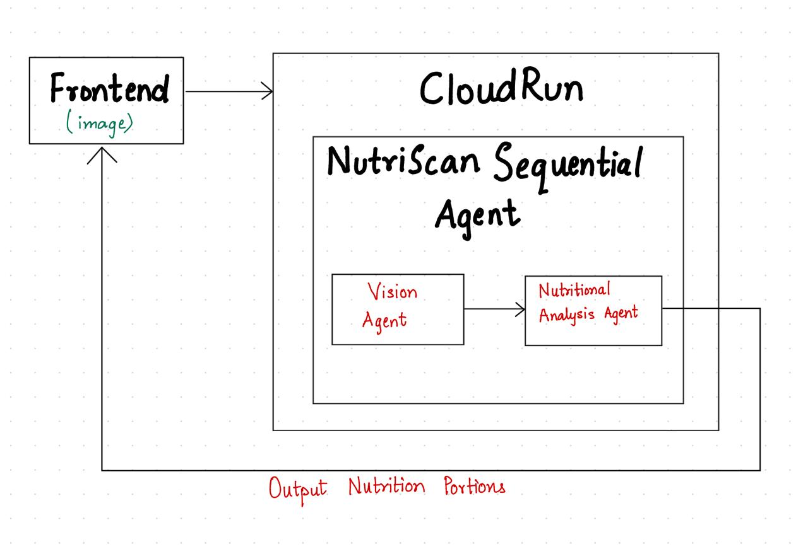

# 🥗 NutriScan  
**Multi-Agent Nutrition Analysis System**  
Built for the **Google Cloud Run Hackathon**

---

## 🚀 Overview

NutriScan analyzes food images and returns structured nutrition estimates in seconds.

The system uses a **sequential multi-agent architecture** built with Google Agent Development Kit (ADK) and deployed on **Google Cloud Run** for scalable, low-latency inference.

Capture → Detect → Estimate → Structured Output.

---

## 🎥 Demo

▶️ Watch the demo here:  
https://youtu.be/4EbKh5Ua81w?si=7TsdbIrIhyHIAPiU

---

## 🧠 How It Works

### 1️⃣ Vision Agent
- Accepts food image  
- Detects food items  
- Outputs structured food labels  

### 2️⃣ Nutrition Analysis Agent
- Takes structured labels  
- Estimates calories & macronutrients  
- Returns consistent JSON response  

Agents operate sequentially to ensure modular reasoning and clean outputs.

---

## 🏗 Architecture



**Flow:**
1. React Native frontend captures image  
2. Image sent to FastAPI backend (Cloud Run)  
3. Vision Agent → Nutrition Analysis Agent  
4. Structured nutrition response returned  

---

## ⚙️ Tech Stack

**Backend**
- Python  
- FastAPI  
- Google ADK  
- Docker  
- Google Cloud Run  

**Frontend**
- React Native  
- Camera integration  

---

## 📂 Project Structure

nutriscan_agent/
│
├── sub_agents/
│ ├── vision_agent/
│ │ ├── init.py
│ │ └── agent.py
│ │
│ └── nutrition_analysis_agent/
│ ├── init.py
│ └── agent.py
│
├── agent.py # Sequential orchestrator
├── requirements.txt
├── README.md
└── .gitignore


---

## 🧪 Example API Response

```json
{
  "food_items": ["Grilled Chicken", "Rice", "Broccoli"],
  "nutrition_estimate": {
    "calories": 520,
    "protein_g": 42,
    "carbs_g": 55,
    "fat_g": 18
  }
}

---

**## 🐳 Run Locally**
```bash
pip install -r requirements.txt
uvicorn agent:app --reload
```

---
☁️ Deploy to Cloud Run
```bash
gcloud builds submit --tag gcr.io/PROJECT-ID/nutriscan
gcloud run deploy nutriscan \
  --image gcr.io/PROJECT-ID/nutriscan \
  --platform managed \
  --region us-central1 \
  --allow-unauthenticated
```

---
